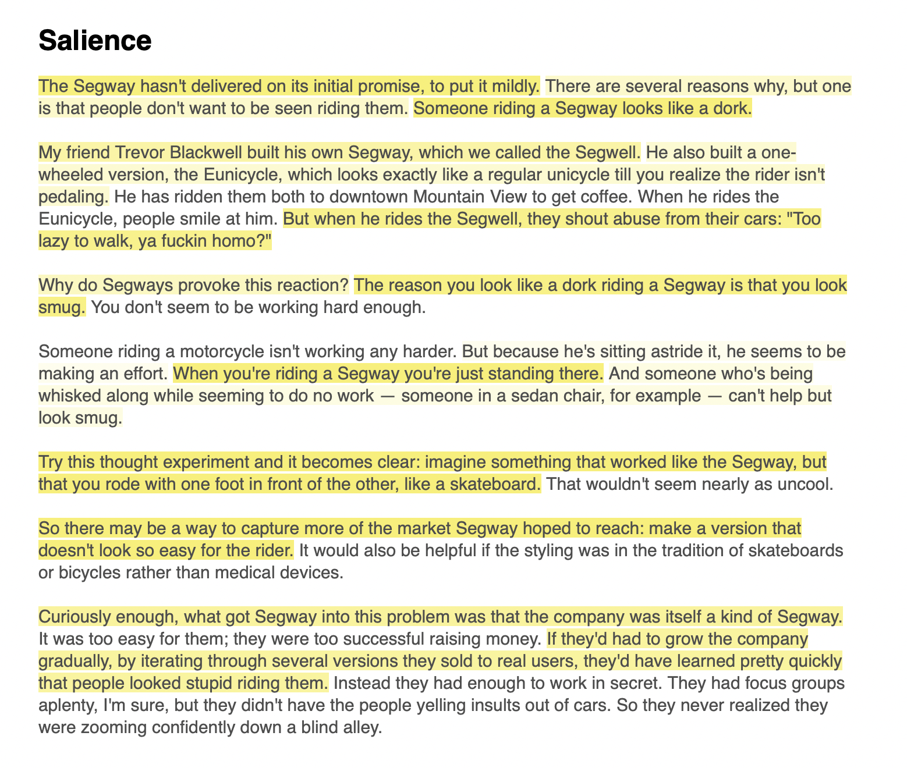

# salience

> In short, a graph-based ranking algorithm is a way of deciding on the
> importance of a vertex within a graph, by taking into account global
> information recursively computed from the entire graph, rather than relying
> only on local vertex-specific information ...  In this paper, we introduced
> TextRank – a graph-based ranking model for text processing.
> 
> (Rada Mihalcea and Paul Tarau, "TextRank: Bringing Order into Texts", 2004)

Extractive summarization should be preferred over abstractive summarization
when nuance is essential and when the summary is meant as a companion to the
source text. LLMs are effective at abstractive summarization, but they can also
be leveraged in extractive summarization. Rather than solve this with a prompt,
LLM embeddings can be combined with the TextRank algorithm to reliably yield
high-quality extractive summaries.

In other words, embeddings can be used to automatically generate highlights. The
internal representation is an affinity matrix between sentences that can be used
to find the most salient sentences in a text.

## Preview



## How to Run

```sh
$ poetry install
$ poetry run flask --app salience run
```

This will kick off a flask server. You can access the output at `http://127.0.0.1:5000/static/index.html`
